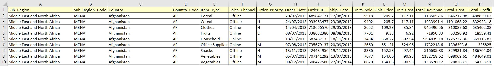

# Interactive Frontend Development Project

A Dashboard for visualizing fictitious sales data has been developed using technologies 
that have been learned throughout the Interactive Frontend Development section of this full stack 
web developer course.

### Sales records csv 

Fictitious Sales records data was downloaded from the following location  
http://eforexcel.com/wp/downloads-18-sample-csv-files-data-sets-for-testing-sales   
and year 2013 was selected from the data.

The layout of the data is as follows 

| Variable        | Format      |
|-----------------|-------------|
| Sub_Region      | Alphabetic  |
| Sub_Region_Code | Alphabetic  |
| Country         | Alphabetic  |
| Country_Code    | Alphabetic  |
| Item_Type       | Alphabetic  |
| Sales_Channel   | Alphabetic  |
| Order_Priority  | Alphabetic  |
| Order_Date      | dd/mm/yyyy  |
| Order_ID        | Alphabetic  |
| Ship_Date       | dd/mm/yyyy  |
| Units_Sold      | Numeric     |
| Unit_Price      | Numeric     |
| Unit_Cost       | Numeric     |
| Total_Revenue   | Numeric     |
| Total_Cost      | Numeric     |
| Total_Profit    | Numeric     |

###  Purpose of Website

The purpose of the dashboard is to visualize fictitious sales data with the following  
DC.js NumberDisplays, Charts & Table.  

    01) dc.numberDisplay  ("#dc-total-cost-display");
    02) dc.numberDisplay  ("#dc-total-profit-display");
    03) dc.numberDisplay  ("#dc-total-revenue-display");
    04) dc.numberDisplay  ("#dc-total-unit-count-display");
    05) dc.rowChart       ("#dc-units-sold-sub-region-chart");
    06) dc.selectMenu     ("#country-units-sold-selector")
    07) dc.rowChart       ("#dc-units-sold-item-type-chart");
    08) dc.rowChart       ("#dc-total-units-sold-chart");
    09) dc.compositeChart ("#dc-totals-chart");
    10) dc.pieChart       ("#dc-pie-chart");
    11) dc.dataTable      ("#dc-data-table");

### Deployment of Website

A Wireframe Mock-up has been created using *Mockup Pro*  
Please see [Dashboard_Mockup.pdf](Dashboard_Mockup.pdf)

The Dashboard was developed in AWS Cloud9 workspace using a mobile first approach.   
To test this approach Google Chrome DevTools '**device mode**' was used for the following devices.

Iphone 5/SE, Iphone 6/7/8, Iphone 6/7/8 Plus, Iphone x, Ipad, and Ipad Pro. 

All changes commited to Git, Then when complete the website was pushed to GitHub.  

### Built With

The following software is required to be able to create the Dashboard 
and was uploaded to the workspace and envoked via the INDEX.HTML file.

Versions of the software are documented in the brackets below.

    <!-- BOOTSTRAP minified CSS file (v4.1.3)                           --> <link rel="stylesheet" type="text/css" href="./static/css/bootstrap.min.css"/>
    <!-- DC.js minified CSS file (v2.1.10)                              --> <link rel="stylesheet" type="text/css" href="./static/css/dc.min.css"/>
    <!-- FONT AWESOME minified CSS file (v4.7.0)                        --> <link rel="stylesheet" type="text/css" href="https://cdnjs.cloudflare.com/ajax/libs/font-awesome/4.7.0/css/font-awesome.min.css"/> 
    <!-- GOOGLE FONT CSS file                                           --> <link rel="stylesheet" type="text/css" href="https://fonts.googleapis.com/css?family=Lato:200,400"/>
    <!-- My dashboard CSS file                                          --> <link rel="stylesheet" type="text/css" href="./static/css/main.css">
   
    <!-- D3.js minified JavaScript file (v3.5.17)                       --> 
    <!-- D3.js time-format minified JavaScript file (v2.1.1)            -->  
    <!-- CROSSFILTER minified JavaScript file (v1.4.6)                  --> 
    <!-- DC.js minified JavaScript file (v2.1.10)                       --> 
    <!-- JQUERY minified JavaScript file (v3.3.1)                       -->  
    <!-- BOOTSTRAP minified JavaScript file (v4.1.3)                    --> 
    <!-- QUEUE minified JavaScript file (v1.0.7)                        --> 
    <!-- My dashboard JavaScript file                                   -->  

* [AWS Cloud9](https://aws.amazon.com/cloud9/) - Cloud-based integrated development environment (IDE) 
* [Bootstrap](https://getbootstrap.com/) - Front-end component library
* [Crossfilter.js](https://github.com/square/crossfilter) - Crossfilter javascript library
* [Dc.js](http://dc-js.github.io/dc.js/docs/html/) - Multi-Dimensional charting javascript library
* [D3.js](https://d3js.org/) - Data-Driven Documents javascript library
* [D3.schemeSet3](https://github.com/d3/d3-scale-chromatic#schemeSet3) - Color Scheme 
* [Fontawesome](https://fontawesome.com/) - Icon set
* [Git](https://git-scm.com/) - Version Control
* [GitHub](https://github.com/) - Remote Repository
* [Google Font](https://fonts.google.com/) - Font set
* [JQuery.js](https://jquery.com/download/) - jQuery javascript library
* [Mockup Pro](https://www.microsoft.com/en-us/p/mockup-pro-wireframe-and.../9nblggh10fcn) - Wireframe mockup
* [Queue.js](https://github.com/d3/d3-queue) - Evaluate asynchronous tasks javascript library

### Acknowledgement(s)

This function to remove empty bins is used to create data processed by the piechart and was taken from 
https://github.com/dc-js/dc.js/wiki/FAQ

    /* Remove empty bins Function (if value = 0), before passing to Chart(s) */  
    
       function remove_empty_bins(source_group) {
         return { all:function () { return source_group.all().filter(function(d) {
              //return Math.abs(d.value) > 0.00001; // if using floating-point numbers
                return d.value !== 0;               // if integers only
                });
            }};
       }
       
This function helped in checking data was correct and was taken from the following article
https://www.codeproject.com/Articles/693841/Making-Dashboards-with-Dc-js-Part-1-Using-Crossfil

    // Print Filter Function Tip   
    
       function print_filter(filter) {
        var f=eval(filter);
         if (typeof(f.length) != "undefined") {} else{}
         if (typeof(f.top) != "undefined") {f=f.top(Infinity);} else{}
         if (typeof(f.dimension) != "undefined") {f=f.dimension(function(d) { return "";}).top(Infinity);} else{}
    	  console.log(filter+"("+f.length+") = "+JSON.stringify(f).replace("[","[\n\t").replace(/}\,/g,"},\n\t").replace("]","\n]"));
       };  
    
### Authors

 **Paul Edward Bennett** 